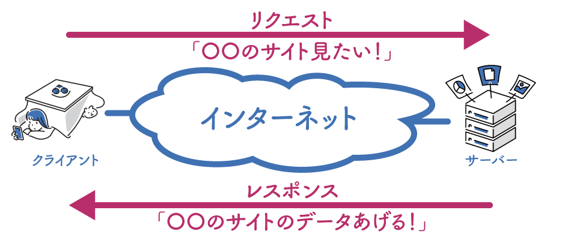
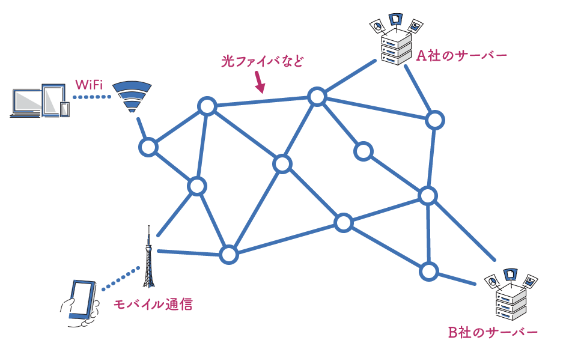

# 全体像

ITシステムの全体像について、簡単に説明します。

## クライアント・サーバーモデル

多くのITシステムは、クライアント・サーバーモデルという形で構成されています。
クライアントは、例えばWebブラウザやスマートフォンアプリなどのユーザーが利用するアプリケーションです。
基本的には

1. クライアントがサーバーに対してリクエストを送信
2. サーバーはリクエストに応じて、適切なデータをレスポンスとしてクライアントに返す

という流れで動作します。

これだけだと分かりにくいので、具体的な例で説明します。
あるwebサイトを見ることを考えます。
ユーザーがリンクを押すとかすると、ブラウザはリンク先のサーバーに対して「webサイト見たいからデータちょうだい！」みたいなリクエストを送ります。
サーバーはそのリクエストを受け取ると、「OK!そのサイトのデータあげる！」というレスポンスを返します。
ブラウザはその受け取ったデータを元に、いつも見るようなwebサイトを表示してくれています。

<!-- SNSの例を追記する -->

