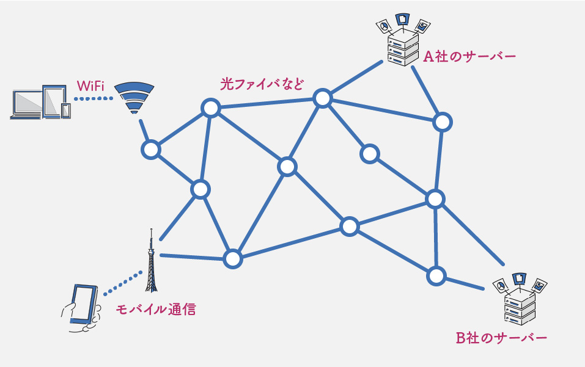

# 全体像

ITシステムの全体像について、簡単に説明します。

多くのITシステムは、**クライアント・サーバーモデル**という形で構成されています。[^p2p]
クライアントは、例えばWebブラウザやスマートフォンアプリなどのユーザーが利用するアプリケーションです。
基本的には

1. クライアントがサーバーに対してリクエストを送信
2. サーバーはリクエストに応じて、適切なデータをレスポンスとしてクライアントに返す

という流れで動作します。

[^p2p]: 他にはP2P (Peer to Peer) という形もあります。

これだけだと分かりにくいので、具体的な例で説明します。
あるwebサイトを見ることを考えます。
ユーザーがリンクを押すとかすると、ブラウザはリンク先のサーバーに対して「webサイト見たいからデータちょうだい！」みたいなリクエストを送ります。
サーバーはそのリクエストを受け取ると、「OK!そのサイトのデータあげる！」というレスポンスを返します。
ブラウザはその受け取ったデータを元に、いつも見るようなwebサイトを表示してくれています。

<!-- SNSの例を追記する -->

このように、クライアント・サーバーモデルは、クライアントとサーバーがそれぞれ役割を持って動作することで成り立っています。
サーバーから見える部分とその裏ということで、クライアントで動くソフトウェアのことを**フロントエンド**、サーバーで動くソフトウェアのことを**バックエンド**と呼ぶことがあります。
「フロントエンドエンジニア」「バックエンドエンジニア」という言葉があるのはこのためです。

バックエンドのソフトウェアが動くサーバーの基本的な仕組みは、普段使うパソコンとほとんど同じです。
しかし、サーバーはサービスを提供するためのものなので

- 大量のアクセスに耐え、
- 24時間365日止まらずに動き続ける

必要があります。
大きなサービスになると1台じゃ足りないので、大量のサーバーを組み合わせて運用することもあります。
サーバー編ではサーバーの仕組みと、サービスを落とさずに動かし続けるための工夫や技術について、解説していきます。

クライアントとサーバーの間の通信は**インターネットを介して行われますが、そもそもインターネットとは何でしょうか。
その正体は、**世界中の機器を繋ぐケーブルや電波の巨大な網**と、**正しい相手と効率よく通信するための仕組みの集まり**です。
それを（かなり）簡略化して描いた図が以下の図です。
普段何気なく使っているインターネットは、このような世界規模の巨大なシステムです。
そのようなシステムの仕組みとそれを支える技術については、ネットワーク編で解説します。

