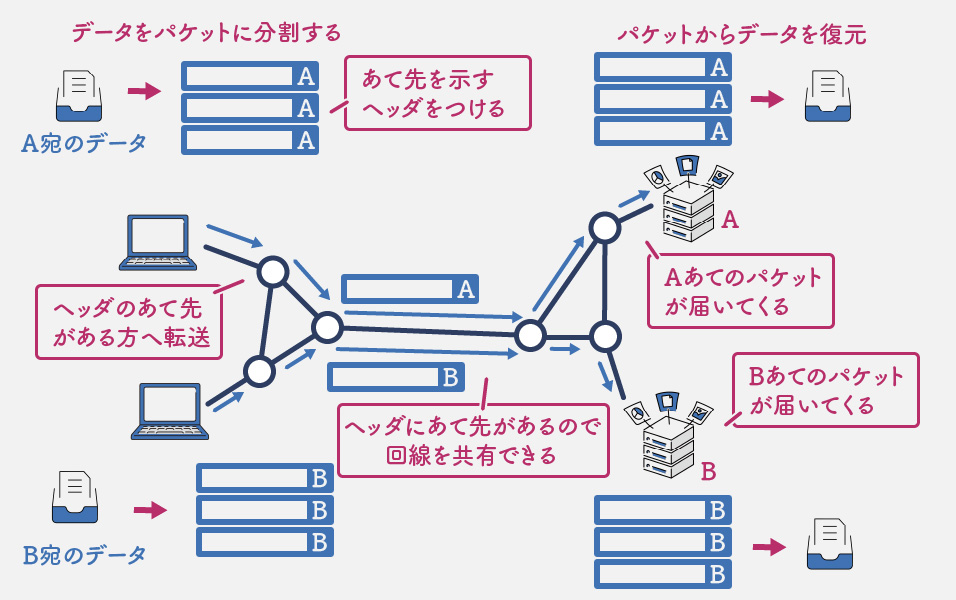
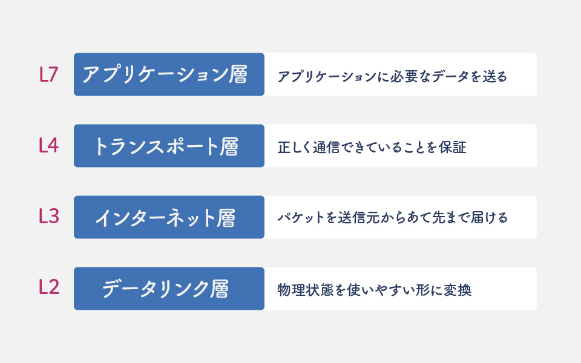

# 基礎知識

まず初めに、現代のネットワーク技術における基本的な概念として

- パケット交換方式
- アドレス
- TCP/IP

について、説明していきます。

## パケット交換方式

ネットワークはパケット交換方式と呼ばれる方法で通信します。電話は自分と相手の間に二人だけの回線を用意することで通話できるようになっているのですが、ネットワークは異なります。相手に送りたいデータをパケットと呼ばれる塊に分割し、それに宛先などを示すヘッダと呼ばれるものをつけて送ります。同じ回線の上をいろんな機器からそれぞれの宛先への通信が通りますが、ヘッダを見れば宛先が分かるため問題ありません。

身近な宅配で例えてみると、荷物をダンボールに詰めて送り状に送り先を書いているような感じです。送り状を見れば誰宛ての荷物かが分かるので、トラックでまとめて運ぶことができます。

## アドレス

通信の送り先を表すアドレスの代表例としては、**MACアドレス**と**IPアドレス**の2種類があります。

MACアドレスは主に物理的な通信で使われるアドレスです。製品の製造時に世界で一意の値が設定される値で、ネットワーク管理者が変更することはありません。次で説明するTCP/IPプロトコルスタックにおいて、データリンク層に関連するアドレスです。

IPアドレスは、各機器のネットワーク上の位置を示す住所のようなもので、ネットワーク管理者が設定します。このIPアドレスを見ることで送っているデータの宛先がインターネット上のどの位置にあるのかが分かります。宅配便の例では、これが送り状の住所に相当します。TCP/IPプロトコルスタックにおいて、インターネット層に関連するアドレスです。

インターネット上のコンピュータと通信するには相手のIPアドレスを指定する必要があるのですが、これは通常32bitまたは128bitの値であり、人間には分かりにくいものです。そこで、kmc.gr.jpのような文字で宛先を表す仕組みが考えられました。この文字のことをドメイン名と呼びます。そして、ドメイン名からIPアドレスを見つける仕組みを名前解決と呼び、そのための仕組みが**DNS**です。

<!-- ## プロトコル

 -->

## TCP/IP

**TCP/IP**プロトコルスタックとは、今世界中でよく使われているプロトコルの集まりのことです。中心的な役割を果たすTCPとIPという2つのプロトコルの名前をとってTCP/IPとよく呼ばれます。

プロトコルはその役割によっていくつかのグループに分けられており、そのグループのことをレイヤーと呼びます。

**データリンク層**は物理的に繋がった機器同士で通信するためのものです。IPアドレスから、実際に通信するのに必要なMACアドレスを見つけるARPなどが含まれます。また、イーサネットやWi-Fiといった通信のための規格もこの層に含められることが多いです。L2とも呼ばれます。

**ネットワーク層**はIPアドレスを見ながらいくつかの機器を経由することで全世界の機器と通信できるようにするプロトコルです。IPと呼ばれるプロトコルがあります。IPv4とIPv6の2種類のバージョンがあり、現在はどちらも使われています。L3とも呼ばれます。

**トランスポート層**は、インターネット層のプロトコルによって通信できるようになった送り元と宛先との間のプロトコルです。TCPとUDPの2種類が有名です。コンピュータの中のどのアプリケーションのための通信かを制御したり、正しくデータを送れているか確認したりします。L4とも呼ばれます。

**アプリケーション層**のプロトコルは、各アプリケーションを使うのに必要なデータをどう送るかを決めています。WebのためのHTTPや、メールのためのSMTP, POP, IMAPなどがあります。名前解決のためのDNSもアプリケーション層のプロトコルです。L7とも呼ばれます。

